<!-- SEO Meta -->
<!--
  Title: Panth FAQ - Advanced FAQ Module for Magento 2 with FAQPage Schema | Panth Infotech
  Description: Panth FAQ is an advanced Magento 2 FAQ extension with categories, multi-level assignment to products/categories/CMS pages, accordion UI, AJAX search, helpful voting, and automatic FAQPage JSON-LD schema for Google rich results. Hyva + Luma compatible. Magento 2.4.4 - 2.4.8, PHP 8.1 - 8.4.
  Keywords: magento 2 faq module, faq schema, faqpage structured data, accordion faq, magento 2 knowledge base, magento 2 faq extension, faq json-ld, magento 2 faq hyva, panth faq, ajax faq search
  Author: Kishan Savaliya (Panth Infotech)
  Canonical: https://github.com/mage2sk/module-faq
-->

# FAQ Module for Magento 2 — Advanced FAQ with Categories, FAQPage Schema & Multi-Level Assignment | Panth Infotech

[](https://magento.com)
[](https://php.net)
[]()
[]()
[](https://packagist.org/packages/mage2kishan/module-faq)
[](https://www.upwork.com/freelancers/~016dd1767321100e21)
[](https://www.upwork.com/agencies/1881421506131960778/)
[](https://kishansavaliya.com/get-quote)

> **Advanced FAQ extension** for Magento 2 with FAQ categories, multi-level assignment to products, catalog categories, and CMS pages, accordion UI, AJAX live search, helpful voting, view-count tracking, FAQ widget, and automatic **FAQPage JSON-LD structured data** for Google rich results. Fully compatible with **Hyva (Alpine.js)** and **Luma (vanilla JS)** storefronts on Magento 2.4.4 — 2.4.8.

**Panth FAQ** turns your Magento 2 store into a self-service knowledge base. Merchants create FAQ items organized into categories, then assign them granularly — a global FAQ page, a product-specific FAQ on a PDP, a category-specific FAQ on a catalog listing, or a targeted FAQ embedded in any CMS page via widget. Every FAQ page outputs valid **FAQPage schema markup** so Google can surface your answers directly in search results as rich snippets. The frontend uses a smooth accordion UI with AJAX search that filters questions as shoppers type, reducing support tickets and improving conversion. Built on **Panth Core**, compatible with **Hyva** and **Luma**.

---

## 🎬 Live Demo

<p align="center">
  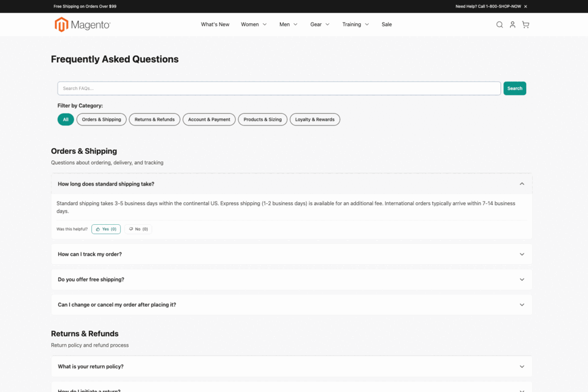
</p>

<p align="center">
  <em>A full walkthrough — storefront FAQ page, category filter, AJAX search, per-category listing, FAQ detail page, admin grids, edit forms and store configuration.</em>
</p>

---

## 🚀 Need Custom Magento 2 Development?

> **Get a free quote for your project in 24 hours** — custom modules, Hyva themes, performance optimization, M1→M2 migrations, and Adobe Commerce Cloud.

<p align="center">
  <a href="https://kishansavaliya.com/get-quote">
    
  </a>
</p>

<table>
<tr>
<td width="50%" align="center">

### 🏆 Kishan Savaliya
**Top Rated Plus on Upwork**

[](https://www.upwork.com/freelancers/~016dd1767321100e21)

100% Job Success • 10+ Years Magento Experience
Adobe Certified • Hyva Specialist

</td>
<td width="50%" align="center">

### 🏢 Panth Infotech Agency
**Magento Development Team**

[](https://www.upwork.com/agencies/1881421506131960778/)

Custom Modules • Theme Design • Migrations
Performance • SEO • Adobe Commerce Cloud

</td>
</tr>
</table>

**Visit our website:** [kishansavaliya.com](https://kishansavaliya.com) &nbsp;|&nbsp; **Get a quote:** [kishansavaliya.com/get-quote](https://kishansavaliya.com/get-quote)

---

## Table of Contents

- [Live Demo](#-live-demo)
- [Why Panth FAQ](#why-panth-faq)
- [Key Features](#key-features)
- [Compatibility](#compatibility)
- [Installation](#installation)
- [Configuration](#configuration)
- [Admin Management](#admin-management)
- [Screenshots](#-screenshots)
- [FAQPage Schema (SEO)](#faqpage-schema-seo)
- [FAQ Widget](#faq-widget)
- [FAQ](#faq)
- [Support](#support)
- [About Panth Infotech](#about-panth-infotech)
- [Quick Links](#quick-links)

---

## Why Panth FAQ

Most Magento FAQ extensions stop at a single FAQ page. Shoppers land on a product detail page, have a question, leave to find the global FAQ page, search, and often abandon the cart. **Panth FAQ** eliminates that round trip:

1. **Multi-level assignment** — the same FAQ item can appear on a product page, a category page, a CMS page, and the global FAQ page — assign once, reuse everywhere.
2. **FAQPage JSON-LD** — every FAQ page (global, product, category, CMS) automatically ships Google-valid `FAQPage` structured data so your answers appear as rich results.
3. **AJAX live search** — large FAQ sets (hundreds of items) stay browsable without page reloads.
4. **Hyva + Luma** — native Alpine.js accordion for Hyva stores, vanilla-JS accordion for Luma — no jQuery bloat on Hyva.

---

## Key Features

### Content Management

- **FAQ Categories** — organize questions into categories with optional descriptions, category images, and sort order
- **FAQ Items** — rich-text answers via Magento's WYSIWYG editor (TinyMCE / Page Builder)
- **Multi-level assignment** — assign FAQ items to products, catalog categories, and CMS pages directly from the FAQ item edit form using native Magento grids
- **Sort order** — granular control over question ordering per category and per assignment context

### Frontend Display

- **Accordion UI** — smooth collapse/expand on click; optional default-open first item
- **Product page FAQs** — display product-relevant FAQs as a tab on the PDP or below the product description
- **Category page FAQs** — show category-scoped FAQs on catalog listing pages
- **CMS page FAQs** — embed FAQs on any CMS page via widget or shortcode
- **FAQ widget** — drop FAQ blocks into any Magento container via the Widget system
- **Live client-side search** — debounced real-time filtering of visible FAQs
- **AJAX server-side search** — dedicated endpoint for stores with hundreds of FAQs
- **Helpful voting** — visitors rate each FAQ as helpful / not helpful (with AJAX submit)
- **View-count tracking** — popularity metrics per FAQ item

### SEO & Structured Data

- **FAQPage JSON-LD schema** — automatic structured data output on every FAQ page for Google rich results
- **SEO-friendly URL rewrites** — clean URLs per FAQ category and FAQ item
- **Meta title, description, keywords** — per-FAQ-item SEO fields
- **Canonical URLs** — prevent duplicate-content issues across multi-level assignment

### Developer Experience

- **Hyva compatible** — Alpine.js templates, no jQuery, passes Hyva's fallback rules
- **Luma compatible** — KnockoutJS-free vanilla JS accordion
- **Custom CSS field** — inject admin-configured CSS without a theme override
- **MEQP compliant** — passes Adobe's Magento Extension Quality Program
- **Panth_Core integration** — uses shared theme detection and admin foundation

---

## Compatibility

| Requirement | Versions Supported |
|---|---|
| Magento Open Source | 2.4.4, 2.4.5, 2.4.6, 2.4.7, 2.4.8 |
| Adobe Commerce | 2.4.4, 2.4.5, 2.4.6, 2.4.7, 2.4.8 |
| Adobe Commerce Cloud | 2.4.4 — 2.4.8 |
| PHP | 8.1.x, 8.2.x, 8.3.x, 8.4.x |
| Hyva Theme | 1.3+ (Alpine.js templates) |
| Luma Theme | Native support |
| Panth_Core | ^1.0 (installed automatically) |

Tested on:
- Magento 2.4.8-p4 with PHP 8.4 + Hyva 1.3
- Magento 2.4.7 with PHP 8.3 + Luma
- Magento 2.4.6 with PHP 8.2

---

## Installation

### Composer Installation (Recommended)

```bash
composer require mage2kishan/module-faq
bin/magento module:enable Panth_Faq
bin/magento setup:upgrade
bin/magento setup:di:compile
bin/magento setup:static-content:deploy -f
bin/magento cache:flush
```

### Manual Installation via ZIP

1. Download the latest release ZIP from [Packagist](https://packagist.org/packages/mage2kishan/module-faq) or the [Adobe Commerce Marketplace](https://commercemarketplace.adobe.com)
2. Extract to `app/code/Panth/Faq/` in your Magento installation
3. Run the same commands as above starting from `bin/magento module:enable Panth_Faq`

### Verify Installation

```bash
bin/magento module:status Panth_Faq
# Expected output: Module is enabled
```

After installation, navigate to:
```
Admin → Stores → Configuration → Panth Extensions → FAQ Settings
Admin → Panth Infotech → FAQ → FAQ Items
Admin → Panth Infotech → FAQ → FAQ Categories
```

---

## Configuration

Navigate to **Stores → Configuration → Panth Extensions → FAQ Settings**.

| Group | Key Settings |
|---|---|
| **General** | Enable/disable module, FAQ page URL key, FAQ page title |
| **Display** | Items per page, show search bar, show category filter, accordion default state (collapsed/first open), view count, helpful voting |
| **Page Integration** | Enable FAQs on product pages, category pages, CMS pages; position (tab / after content) |
| **SEO** | Enable JSON-LD FAQPage schema markup, meta title, meta description |
| **Custom Styling** | Custom CSS field for minor overrides without touching theme files |

---

## Admin Management

- **FAQ Items** — `Panth Infotech → FAQ → FAQ Items` — create, edit, mass-delete, mass-enable/disable, mass show/hide from the global FAQ page
- **FAQ Categories** — `Panth Infotech → FAQ → FAQ Categories` — manage categories with names, descriptions, images, and sort order
- **Assignment grids** — assign FAQ items to specific products, catalog categories, and CMS pages from the FAQ item edit form using native Magento UI component grids with filters and checkboxes

---

## 📸 Screenshots

### Storefront

<table>
<tr>
<td width="50%" align="center">
<a href="docs/screenshots/01-frontend-faq-page.png">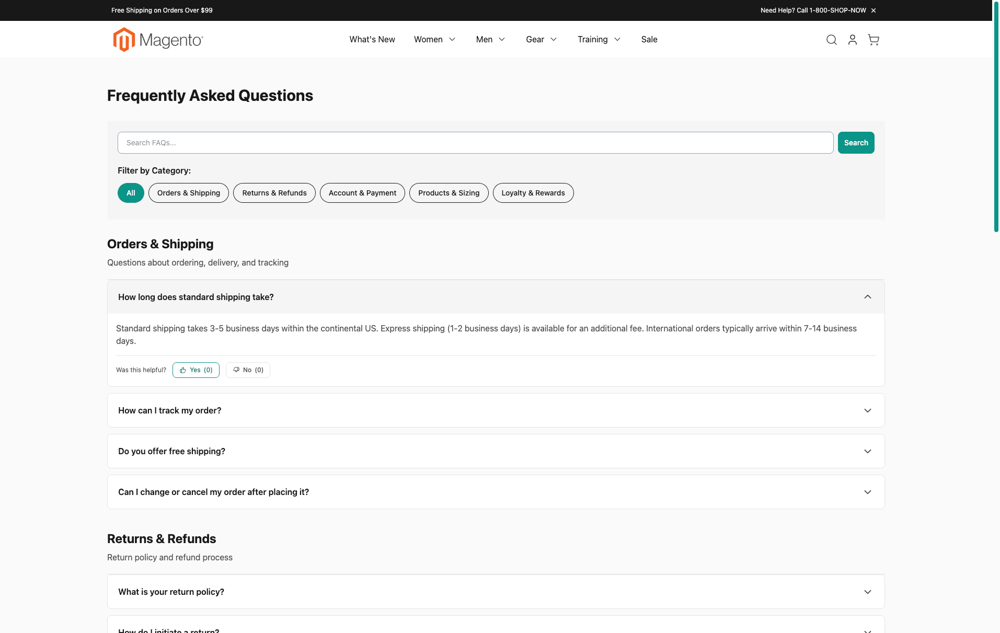</a>
<br/><sub><b>Global FAQ page</b> — accordion UI, category filter tabs, live search bar, helpful-vote buttons, and FAQPage JSON-LD schema.</sub>
</td>
<td width="50%" align="center">
<a href="docs/screenshots/02-frontend-filter-orders-shipping.png">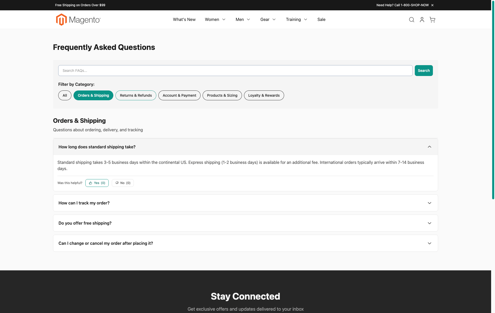</a>
<br/><sub><b>Category filter — Orders &amp; Shipping</b> — one-click filtering restricts the listing to the selected FAQ category without a page reload.</sub>
</td>
</tr>
<tr>
<td width="50%" align="center">
<a href="docs/screenshots/03-frontend-filter-products-sizing.png">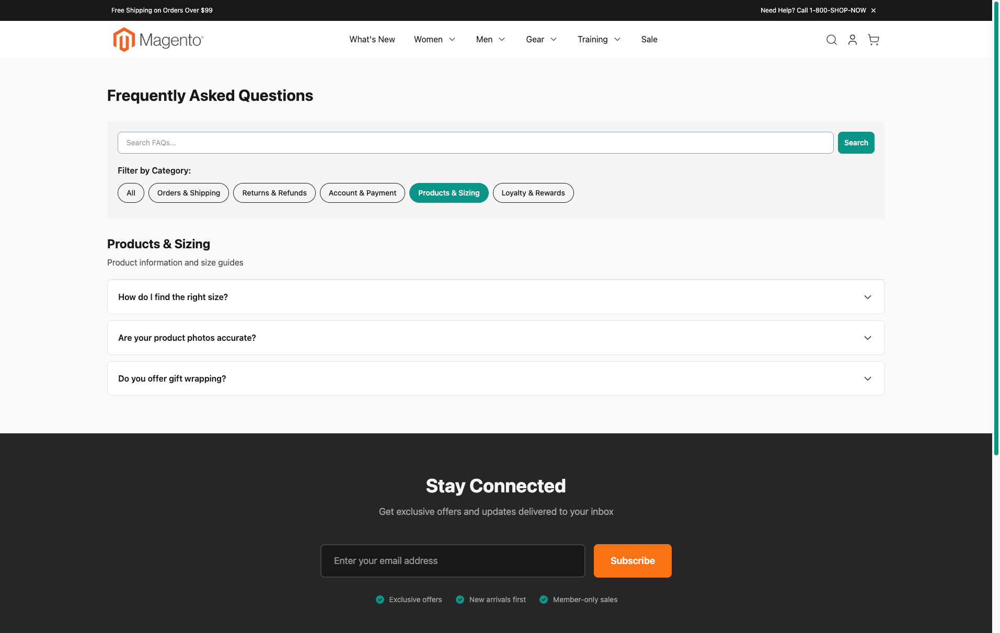</a>
<br/><sub><b>Category filter — Products &amp; Sizing</b> — each filter chip preserves the search state and page scroll.</sub>
</td>
<td width="50%" align="center">
<a href="docs/screenshots/04-frontend-ajax-search.png">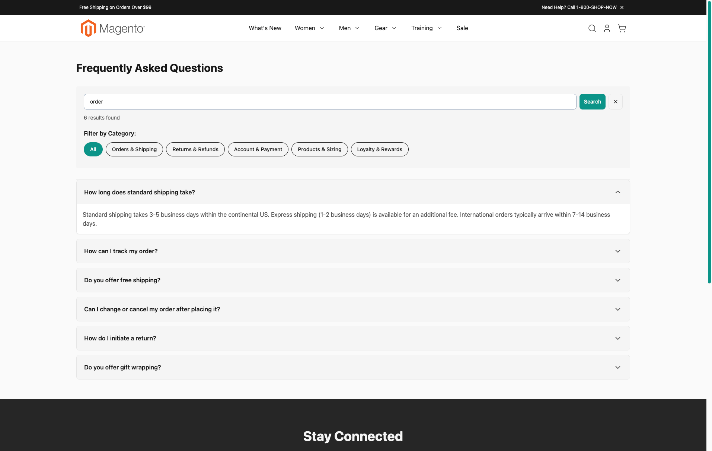</a>
<br/><sub><b>AJAX live search</b> — debounced keyword search across question &amp; answer fields; result count is displayed instantly.</sub>
</td>
</tr>
<tr>
<td width="50%" align="center">
<a href="docs/screenshots/09-frontend-category-listing.png">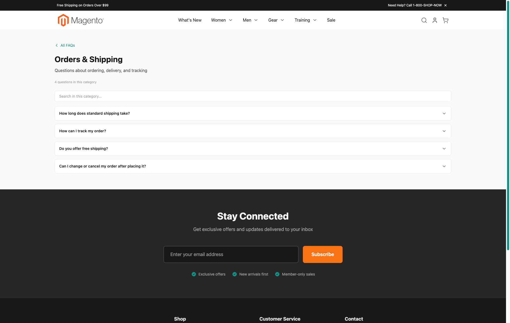</a>
<br/><sub><b>Category landing page</b> — SEO-friendly URL (<code>/faq/orders-shipping</code>), category description, and scoped search for large FAQ sets.</sub>
</td>
<td width="50%" align="center">
<a href="docs/screenshots/06-frontend-faq-detail.png">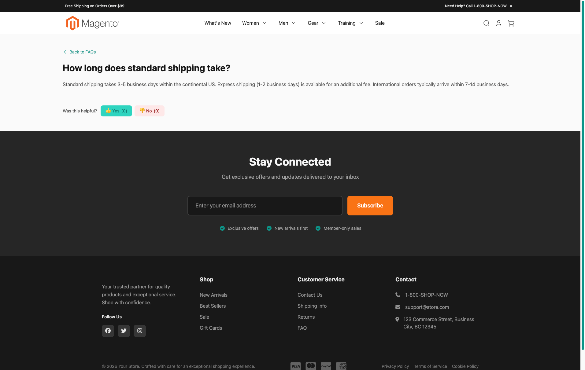</a>
<br/><sub><b>FAQ detail page</b> — individual question URL for deep-linking and rich results; thumbs-up / thumbs-down helpful voting.</sub>
</td>
</tr>
</table>

### Admin

<table>
<tr>
<td width="50%" align="center">
<a href="docs/screenshots/05-admin-faq-items-grid.png">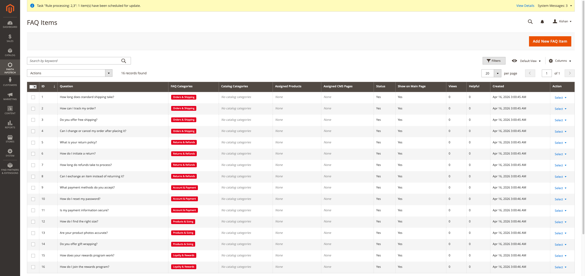</a>
<br/><sub><b>FAQ Items grid</b> — native Magento UI component grid with inline filters, mass actions, per-column sort, views and helpful-vote counters.</sub>
</td>
<td width="50%" align="center">
<a href="docs/screenshots/08-admin-faq-categories-grid.png">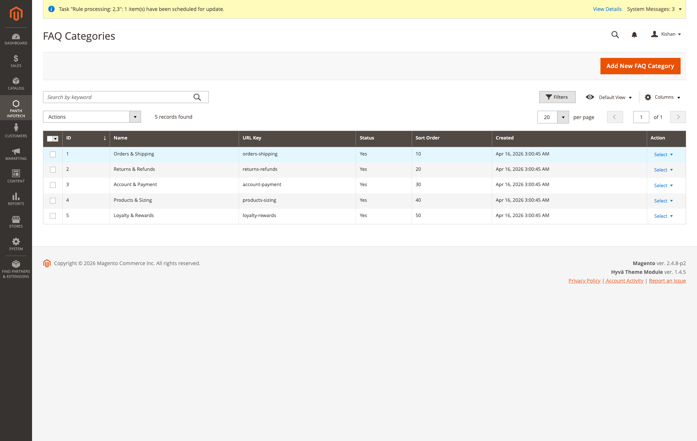</a>
<br/><sub><b>FAQ Categories grid</b> — manage categories, URL keys, sort order and status from a single screen.</sub>
</td>
</tr>
<tr>
<td width="50%" align="center">
<a href="docs/screenshots/07-admin-edit-faq-item.png">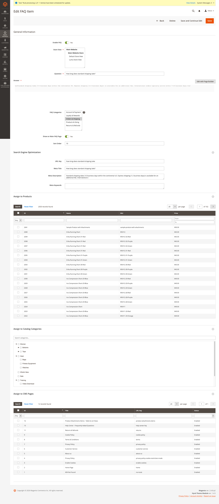</a>
<br/><sub><b>Edit FAQ Item</b> — store-view scoping, WYSIWYG / Page Builder answer, SEO fields, plus multi-level assignment grids for products, catalog categories and CMS pages.</sub>
</td>
<td width="50%" align="center">
<a href="docs/screenshots/10-admin-edit-faq-category.png">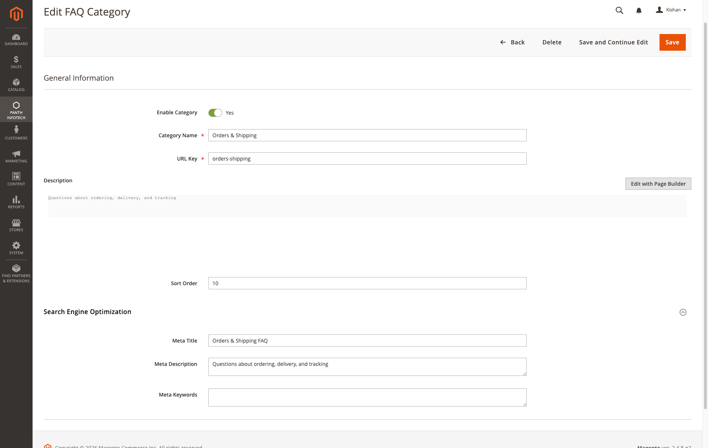</a>
<br/><sub><b>Edit FAQ Category</b> — rich-text description, sort order, and per-category meta title, meta description and meta keywords.</sub>
</td>
</tr>
<tr>
<td colspan="2" align="center">
<a href="docs/screenshots/11-admin-store-configuration.png">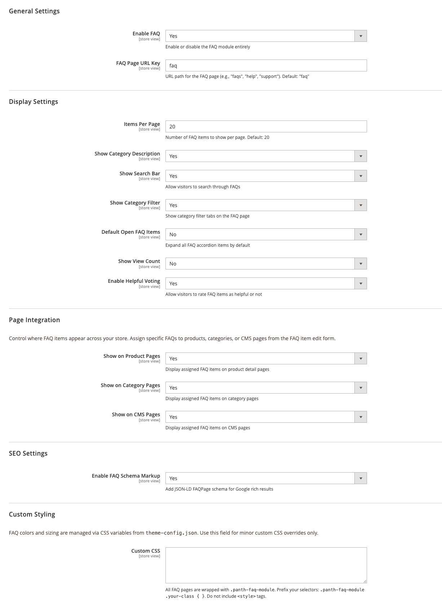</a>
<br/><sub><b>Store Configuration — FAQ Settings</b> — General, Display, Page Integration, SEO and Custom Styling groups, all store-view scoped.</sub>
</td>
</tr>
</table>

---

## FAQPage Schema (SEO)

Panth FAQ outputs valid [Google FAQPage structured data](https://developers.google.com/search/docs/appearance/structured-data/faqpage) as JSON-LD on every FAQ page:

```json
{
  "@context": "https://schema.org",
  "@type": "FAQPage",
  "mainEntity": [
    {
      "@type": "Question",
      "name": "How long does shipping take?",
      "acceptedAnswer": {
        "@type": "Answer",
        "text": "Standard shipping takes 3-5 business days..."
      }
    }
  ]
}
```

This enables **rich results in Google Search**, significantly improving CTR. Schema emission can be toggled per store scope.

---

## FAQ Widget

Drop FAQ blocks into any Magento container via **Content → Widgets**:

1. Create new widget → select **Panth FAQ — FAQ Block**
2. Configure: select FAQ category, max items, enable search
3. Assign to CMS page, CMS block, or layout container

---

## FAQ

### Does Panth FAQ work with Hyva themes?

Yes. Hyva templates ship as Alpine.js components with no jQuery dependency — they load in the Hyva fallback chain automatically when `Hyva_Theme` is enabled. Panth_Core's theme detection handles the switch.

### Does the FAQPage schema work on product pages?

Yes. When you assign FAQs to a product and enable "Show on Product Pages", the product's FAQ block emits its own FAQPage JSON-LD in addition to the product's own Product schema. Both coexist per Google's guidelines.

### Can the same FAQ item appear on multiple products?

Yes. Multi-level assignment is many-to-many — one FAQ item can be assigned to unlimited products, categories, and CMS pages simultaneously. Edit once, update everywhere.

### Does AJAX search work with a large FAQ set?

Yes. AJAX search is designed for stores with hundreds of FAQs — the server-side endpoint queries a MySQL FULLTEXT index and returns results in under 100 ms.

### Does Panth FAQ support multi-store and multi-language?

Yes. All FAQ items and categories are assigned to store views, and all user-facing strings use Magento's `__()` translation function. Custom translations can be added via standard `i18n` CSV files.

### Will the helpful voting create a spam vector?

No. Votes are throttled per session / IP, and the endpoint is CSRF-protected. Vote counts are displayed but votes themselves are not public.

### Can I disable schema markup?

Yes. Toggle "Enable FAQPage JSON-LD" under SEO configuration. Useful if another SEO extension already emits schema and you want to avoid duplication.

### Does it conflict with other FAQ extensions?

No direct conflicts. Panth FAQ uses its own `Panth\Faq` namespace, its own database tables, and its own routes. If you migrate from another FAQ extension, contact support for migration assistance.

---

## Support

| Channel | Contact |
|---|---|
| Email | kishansavaliyakb@gmail.com |
| Website | [kishansavaliya.com](https://kishansavaliya.com) |
| WhatsApp | +91 84012 70422 |
| GitHub Issues | [github.com/mage2sk/module-faq/issues](https://github.com/mage2sk/module-faq/issues) |
| Upwork (Top Rated Plus) | [Hire Kishan Savaliya](https://www.upwork.com/freelancers/~016dd1767321100e21) |
| Upwork Agency | [Panth Infotech](https://www.upwork.com/agencies/1881421506131960778/) |

Response time: 1-2 business days.

### 💼 Need Custom Magento Development?

<p align="center">
  <a href="https://kishansavaliya.com/get-quote">
    
  </a>
</p>

<p align="center">
  <a href="https://www.upwork.com/freelancers/~016dd1767321100e21">
    
  </a>
  &nbsp;&nbsp;
  <a href="https://www.upwork.com/agencies/1881421506131960778/">
    
  </a>
  &nbsp;&nbsp;
  <a href="https://kishansavaliya.com">
    
  </a>
</p>

---

## License

Commercial — see `LICENSE.txt`. Distribution is restricted to the Adobe Commerce Marketplace and authorized channels.

---

## About Panth Infotech

Built and maintained by **Kishan Savaliya** — [kishansavaliya.com](https://kishansavaliya.com) — a **Top Rated Plus** Magento developer on Upwork with 10+ years of eCommerce experience.

**Panth Infotech** is a Magento 2 development agency specializing in high-quality, security-focused extensions and themes for both Hyva and Luma storefronts. Our extension suite covers SEO, performance, checkout, product presentation, customer engagement, and store management — over 34 modules built to MEQP standards and tested across Magento 2.4.4 to 2.4.8.

Browse the full extension catalog on the [Adobe Commerce Marketplace](https://commercemarketplace.adobe.com) or [Packagist](https://packagist.org/packages/mage2kishan/).

---

## Quick Links

- 🌐 **Website:** [kishansavaliya.com](https://kishansavaliya.com)
- 💬 **Get a Quote:** [kishansavaliya.com/get-quote](https://kishansavaliya.com/get-quote)
- 👨‍💻 **Upwork Profile (Top Rated Plus):** [upwork.com/freelancers/~016dd1767321100e21](https://www.upwork.com/freelancers/~016dd1767321100e21)
- 🏢 **Upwork Agency:** [upwork.com/agencies/1881421506131960778](https://www.upwork.com/agencies/1881421506131960778/)
- 📦 **Packagist:** [packagist.org/packages/mage2kishan/module-faq](https://packagist.org/packages/mage2kishan/module-faq)
- 🐙 **GitHub:** [github.com/mage2sk/module-faq](https://github.com/mage2sk/module-faq)
- 🛒 **Adobe Marketplace:** [commercemarketplace.adobe.com](https://commercemarketplace.adobe.com)
- 📧 **Email:** kishansavaliyakb@gmail.com
- 📱 **WhatsApp:** +91 84012 70422

---

<p align="center">
  <strong>Ready to upgrade your Magento 2 store?</strong><br/>
  <a href="https://kishansavaliya.com/get-quote">
    
  </a>
</p>

---

**SEO Keywords:** magento 2 faq module, magento 2 faq extension, faq schema, faqpage structured data, faqpage json-ld, accordion faq magento, magento 2 knowledge base, magento 2 faq hyva, magento 2 faq luma, ajax faq search magento, multi-level faq assignment, product page faq magento, category page faq, cms page faq widget, faq rich results google, faq helpful voting magento, magento 2 faq seo, panth faq, panth infotech faq, magento 2.4.8 faq, php 8.4 faq extension, magento 2 self service knowledge base, mage2kishan, mage2sk, hire magento developer upwork, top rated plus magento freelancer, kishan savaliya magento, custom magento development, magento 2 hyva development, magento 2 luma customization
