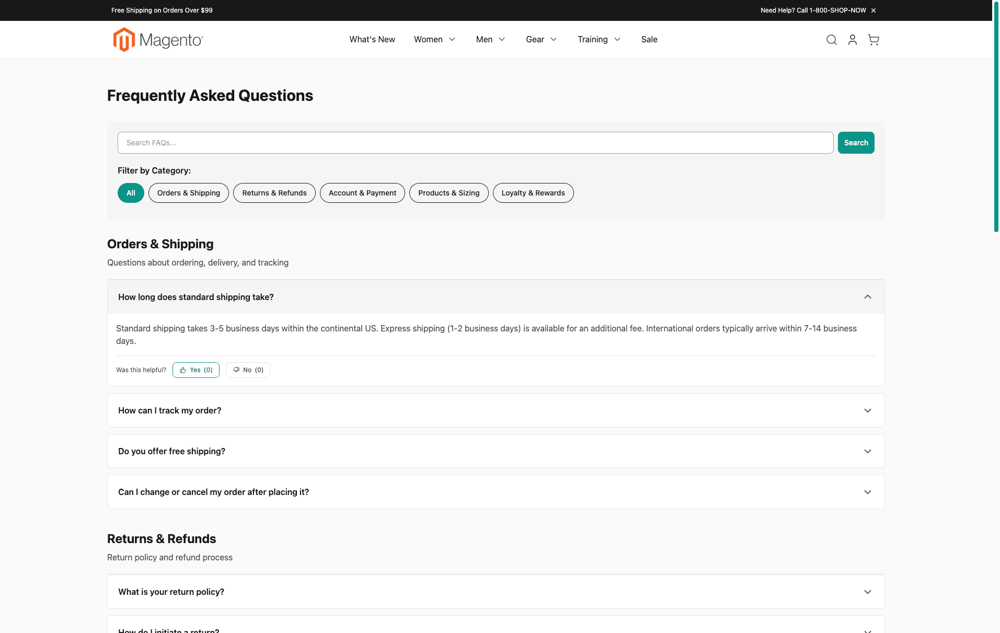
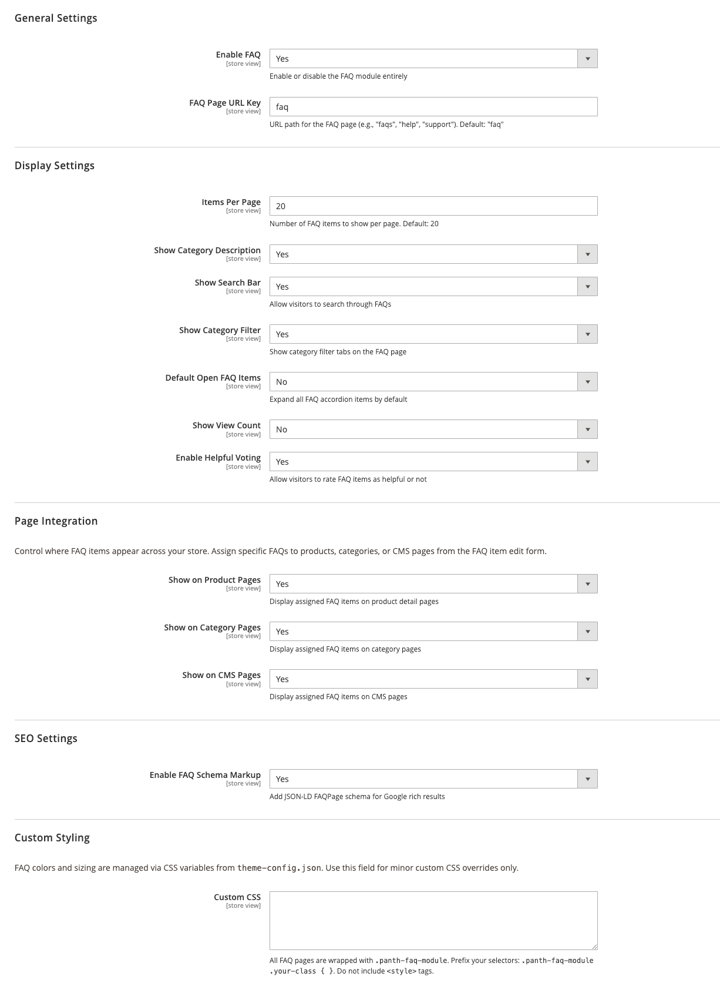
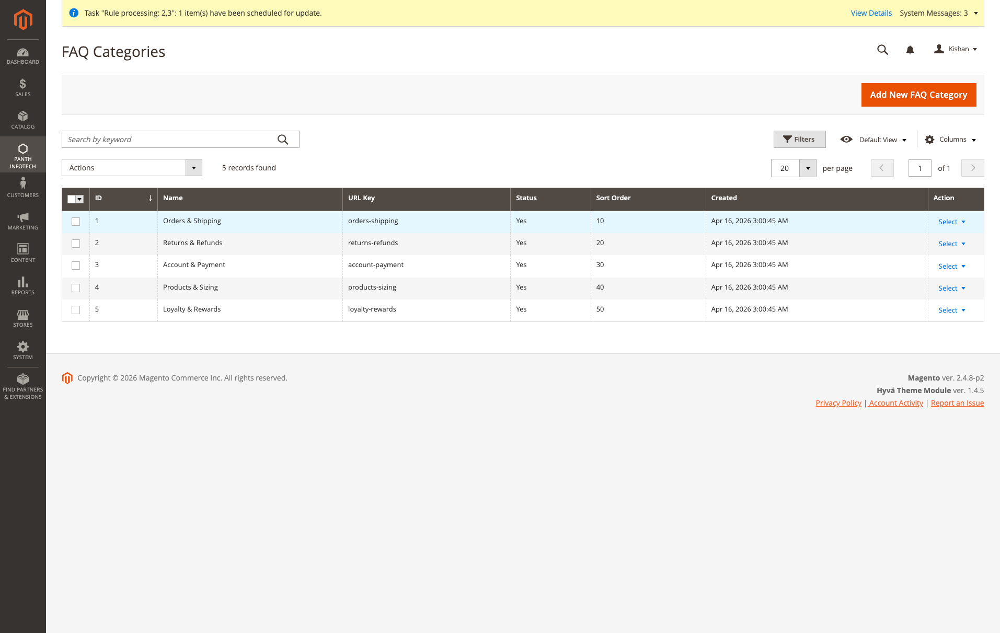
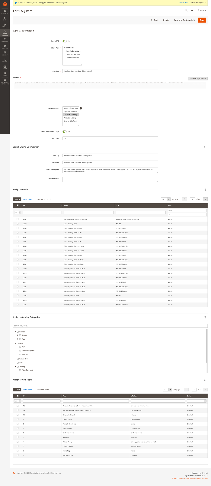

# Magento 2 FAQ

Panth_Faq adds a FAQ system to Magento 2. Store owners create FAQ categories and question/answer items in the admin, assign items to products, catalog categories and CMS pages, and publish them on a standalone FAQ page, on FAQ category pages, on individual FAQ item pages, inside product, category and CMS pages, or through a widget. Each FAQ page can emit FAQPage JSON-LD structured data.

The module ships two template sets: Alpine.js templates for Hyva and vanilla JavaScript templates for Luma. Item and category content can be overridden per store view.

Product page: [kishansavaliya.com/magento-2-faq.html](https://kishansavaliya.com/magento-2-faq.html)



## Features

- FAQ categories with name, URL key, description, icon (jpg, jpeg, gif, png), sort order and meta title, description and keywords.
- FAQ items with a WYSIWYG answer, one or more FAQ categories, URL key, sort order, "Show on Main FAQ Page" flag and meta fields. Items with "Show on Main FAQ Page" switched on (per store view when overridden) are listed in sort order in a "Top Questions" section at the top of the FAQ page on Luma and Hyva, using the same accessible accordion; the section is hidden while a category filter is selected, and those questions are part of the FAQ page FAQPage JSON-LD.
- Per-store-view overrides for item and category content (question, answer, name, URL key, active flag, meta fields), stored in separate override tables; fields left at "Use Default" inherit the default values.
- Assignment of one item to any number of products, catalog categories and CMS pages from the item form, and the reverse direction from a "FAQ Items" fieldset on the product, catalog category and CMS page edit forms.
- Standalone FAQ page at a configurable URL key (default `faq`), with category filter buttons, a search box and an accordion. Search on the FAQ page runs over AJAX (`faq/ajax/search`) and matches the question and answer text with a SQL LIKE query.
- FAQ category pages and FAQ item detail pages with their own URLs, generated URL rewrites and a custom router. Unknown, disabled or deleted items and categories return a 404 page. URL keys typed in the admin are normalised to lowercase letters, digits and hyphens before they are saved.
- Item detail pages count views and derive a meta description from the answer when none is set. The FAQ page, FAQ category pages and item detail pages set a canonical link.
- Accessible accordions on Luma and Hyva: each question trigger exposes `aria-expanded` and `aria-controls`, answers are labelled regions, Enter and Space toggle a question, `#faq-<id>` links open and scroll to that question, controls are at least 44px tall and motion is reduced when the visitor prefers reduced motion.
- Helpful / not helpful voting (`faq/vote/submit`); requests must carry the form key, and repeat votes are blocked in the browser with localStorage and on the server per session, and each client IP may cast a limited number of votes per hour.
- Embedded FAQ blocks on product pages, catalog category pages and CMS pages, each with a client-side search box and a "View All FAQs" link.
- "FAQ List" widget for CMS pages and blocks.
- FAQPage JSON-LD output on FAQ pages and on product, category and CMS pages that have assigned items, with a configurable cap on the number of questions.
- In store view scope the item and category edit forms show the "Use Default Value" checkbox checked for every field without a store value, so saving a store view without changes does not copy the default values into that store view.
- Admin grids for items and categories with mass actions (items: Delete, Show on Main Page, Hide from Main Page, Enable, Disable; categories: Delete), filters, a keyword search on the item grid that matches question, answer and URL key, a keyword search on the category grid that matches name, URL key and description, and "View on Storefront" buttons on the edit forms.
- Colour tokens defined in `etc/theme-config.json` and exposed as CSS variables through the Panth_Core theme configuration.
- Full page and block HTML caches are invalidated automatically when the module configuration is saved. Saving or deleting an item or category refreshes the cached FAQ pages and the product, catalog category and CMS pages that show the item; assignments saved from the product, category and CMS page forms refresh that page.

## Compatibility

| Platform | Versions |
|---|---|
| Magento Open Source | 2.4.4 to 2.4.8 (as published on the product page) |
| Adobe Commerce | 2.4.4 to 2.4.8 (as published on the product page) |
| PHP | 8.1, 8.2, 8.3, 8.4 (`~8.1.0||~8.2.0||~8.3.0||~8.4.0`) |
| Themes | Hyva and Luma |

Composer constraints on Magento packages: `magento/framework ^103.0`, `magento/module-backend ^102.0`, `magento/module-catalog ^104.0`, `magento/module-cms ^104.0`, `magento/module-store ^101.0`, `magento/module-ui ^101.0`, `magento/module-url-rewrite ^102.0`.

## Requirements

- Magento Open Source or Adobe Commerce 2.4.4 to 2.4.8.
- PHP 8.1, 8.2, 8.3 or 8.4.
- `mage2kishan/module-core` `^1.0.17` (module `Panth_Core`). It is installed by Composer as a dependency and provides the admin menu group and the theme configuration used for CSS variables.
- The Magento modules listed in the constraints above (Backend, Catalog, Cms, Store, Ui, UrlRewrite).

## Installation

```bash
composer require mage2kishan/module-faq
bin/magento module:enable Panth_Core Panth_Faq
bin/magento setup:upgrade
bin/magento setup:di:compile
bin/magento setup:static-content:deploy -f
bin/magento cache:flush
```

`setup:di:compile` is only required in production mode. `setup:static-content:deploy` is needed because the module ships CSS and JavaScript under `view/frontend/web`.

Check that the module is enabled:

```bash
bin/magento module:status Panth_Faq
```

## Configuration

Go to Stores > Configuration > Panth Extensions > FAQ Settings. All fields can be set at default, website and store view scope. The configuration section is protected by the `Panth_Faq::config` ACL resource.



### General Settings

| Setting | Default | What it does |
|---|---|---|
| Enable FAQ | Yes | Master switch. When set to No the router ignores FAQ URLs, the FAQ page returns a 404, item and category pages redirect to the home page, and the embedded blocks, widget and schema output stop rendering. |
| FAQ Page URL Key | faq | Path of the FAQ page. Item and category URLs are built as `<key>/item/<url_key>` and `<key>/category/<url_key>`. Requests to `/faq` are redirected to the configured key when it differs. |

Config paths: `panth_faq/general/enabled`, `panth_faq/general/faq_route`. The FAQ page title and meta description are read from `panth_faq/general/meta_title` (default "Frequently Asked Questions") and `panth_faq/general/meta_description`; these two paths have defaults in `etc/config.xml` but no admin field.

### Display Settings

| Setting | Default | What it does |
|---|---|---|
| Items Per Page | 20 | Stored at `panth_faq/display/items_per_page` and read by the FAQ page block. The bundled templates render all items and do not paginate. |
| Show Category Description | Yes | Shows the FAQ category description on the FAQ page and on FAQ category pages. |
| Show Search Bar | Yes | Shows the search box on the FAQ page and on FAQ category pages. |
| Show Category Filter | Yes | Shows the category filter buttons on the FAQ page. |
| Default Open FAQ Items | No | Renders accordion items expanded on the FAQ page and on FAQ category pages. |
| Show View Count | No | Shows the view counter next to items. |
| Enable Helpful Voting | Yes | Shows the helpful / not helpful buttons. |
| Votes Allowed Per Client IP (per hour) | 20 | Votes accepted from one client IP address within an hour, across all items. The IP is read through Magento `RemoteAddress`. 0 turns the limit off. |

Config paths: `panth_faq/display/items_per_page`, `show_category_description`, `show_search`, `show_category_filter`, `default_open_faqs`, `show_view_count`, `enable_helpful_voting`, `vote_rate_limit`.

### Page Integration

| Setting | Default | What it does |
|---|---|---|
| Show on Product Pages | Yes | Renders assigned items on product pages. |
| Product Page Position | FAQ tab | FAQ tab adds an "FAQ" tab to the product tabs (`product.info.details`, group `detailed_info`). Below the product tabs renders a full-width section at the end of the `content` container. Product info column renders the list in `product.info.main` under Add to Cart (the placement used before 1.3.10). Config path `panth_faq/product_page/position`. |
| Show on Category Pages | Yes | Renders assigned items at the end of the `content` container of catalog category pages. |
| Show on CMS Pages | Yes | Renders assigned items at the end of the `content` container of CMS pages. |

Config paths: `panth_faq/product_page/enabled`, `panth_faq/category_page/enabled`, `panth_faq/cms_page/enabled`. Each integration also honours a title and, for product and category pages, an item limit that only exist in `etc/config.xml`: `panth_faq/product_page/title` ("Frequently Asked Questions"), `panth_faq/product_page/limit` (10), `panth_faq/category_page/title` ("Category FAQs"), `panth_faq/category_page/limit` (10), `panth_faq/cms_page/title` ("FAQs"). When more items are assigned than the limit, a "View All FAQs" link to the FAQ page is shown. The `position` values under these paths are defined but not used by the layouts.

### SEO Settings

| Setting | Default | What it does |
|---|---|---|
| Enable FAQ Schema Markup | Yes | Outputs a FAQPage JSON-LD block before the closing body tag. |
| Max Questions Per FAQPage | 30 | Caps the number of Question entries in one JSON-LD block. 0 disables the cap. Shown only when schema markup is enabled. |

Config paths: `panth_faq/seo/enable_schema`, `panth_faq/seo/max_questions`. The canonical link on the FAQ page, FAQ category pages and item detail pages is controlled by `panth_faq/seo/canonical_url` (default 1, no admin field).

### Custom Styling

| Setting | Default | What it does |
|---|---|---|
| Custom CSS | (empty) | Saved to `panth_faq/design/custom_css` and printed in a `<style>` tag in the page head on FAQ pages and on product, category and CMS pages (the `faq_styles` layout handle). Any `<` character is removed from the value. Colours and sizing come from `etc/theme-config.json`. |

### Admin menu

The module adds a "FAQ" group to the Panth_Core admin menu with three entries: Manage Items (`faq/item`), Manage Categories (`faq/category`) and Configuration (opens the section above).

## Usage

### Managing categories

Open Manage Categories and click Add New. The form has the fields Enable Category, Category Name, URL Key, Description, Category Icon, Sort Order and the SEO fields Meta Title, Meta Description and Meta Keywords. Icons are uploaded to `pub/media/panth/faq/category/tmp` and moved to `pub/media/panth/faq/category` when the category is saved; the file name is stored in the `icon` column and the icon is shown above the heading of the FAQ category page. Only JPG, PNG and GIF images are accepted: the upload checks the file extension, the content type detected on the server and that the file is a real image. SVG files are refused on upload, and a category save that refers to an SVG icon is refused too, because an SVG can carry script. Saving a category dispatches `panth_faq_category_save_after`, which regenerates its URL rewrites. Use the store switcher above the form to enter store-view specific values; fields left at "Use Default" inherit the default value.



### Managing items

Open Manage Items and click Add New. The form has General Information (Enable FAQ, Question, Answer with the WYSIWYG editor, FAQ Categories, Show on Main FAQ Page, Sort Order), Search Engine Optimization (URL Key, Meta Title, Meta Description, Meta Keywords) and three assignment grids: Assign to Products, Assign to Catalog Categories and Assign to CMS Pages. The grid supports the mass actions Delete, Show on Main Page, Hide from Main Page, Enable and Disable. Saving an item dispatches `panth_faq_item_save_after`, which regenerates its URL rewrites for every assigned store.



Items can also be assigned from the other side: the product, catalog category and CMS page edit forms each get a collapsible "FAQ Items" fieldset with a selection grid.

### FAQ page and routes

| Page | URL | Internal route |
|---|---|---|
| FAQ page | `/<faq_route>` (default `/faq`) | `faq/index/index` |
| Item detail | `/<faq_route>/item/<url_key>` | `faq/index/view/id/<item_id>` |
| FAQ category | `/<faq_route>/category/<url_key>` | `faq/category/view/id/<category_id>` |

URLs are resolved by `Panth\Faq\Controller\Router` (registered in the frontend router list with sort order 50) and additionally by URL rewrites written on save. Store-view URL key overrides are respected.

The FAQ page lists active categories with their items, followed by an "Other FAQs" section for active items that belong to no FAQ category. The category filter and the search box work without a page reload: the templates post to `faq/ajax/search` with the query and the selected category. The search requires at least 2 characters, uses at most the first 200 characters of the query and returns at most 50 items. Answers in the results are passed through the CMS content filter. The Luma template also accepts a `?q=` parameter for a server-side search.

The item detail page increments `view_count` with a single UPDATE query each time the controller runs (full page cache hits are not counted), sets the page title to the question, adds a canonical link and, when no meta description is set, uses the first 155 characters of the answer text.

### Voting

The helpful / not helpful buttons post `item_id` and `vote` (`yes` or `no`) to `faq/vote/submit`, which increments `helpful_count` or `not_helpful_count` and returns the new counts as JSON. Votes are accepted only while the module and Enable Helpful Voting are on for the store view, and only for items that are active and assigned to the current store view. Each request must include the storefront form key (`form_key`, as a POST field or in the JSON body); requests without a valid form key are rejected with HTTP 403. The templates remember a vote in localStorage, and the endpoint also records voted item ids in the visitor session and refuses a second vote on the same item within that session. In addition, each client IP address may cast at most "Votes Allowed Per Client IP (per hour)" votes (default 20) across all items; further votes get the message "Too many votes from your connection. Please try again later." The counter is kept in the Magento cache for one hour.

### Product, category and CMS page blocks

When the corresponding Page Integration setting is enabled and at least one item is assigned, a block with a title, a client-side search box and an accordion is rendered. On Luma the product, category and CMS templates also append an "Other FAQs" section with active items that are assigned to the current product, category or CMS page, belong to no FAQ category and are not already listed in the main block (for example because of the item limit).

### Widget

Add the "FAQ List" widget from Content > Widgets, or place it in CMS content with the directive:

```
{{widget type="Panth\Faq\Block\Widget\Faq" title="Frequently Asked Questions" faq_items="1,2,3" limit="10" show_view_all="1"}}
```

Parameters: Title (optional heading), FAQ Items (multiselect; empty shows all active items), Number of FAQs to Display (default 10; empty shows all), Show "View All FAQs" Link (default Yes). Selected items are rendered in the order they were selected.

### Structured data

`Panth\Faq\Block\Schema` renders `view/frontend/templates/schema.phtml` in `before.body.end` on the FAQ page (items assigned to a FAQ category), FAQ category pages, item detail pages (that item only), and on product, catalog category and CMS pages that have assigned items and an enabled integration. HTML is stripped from answers. The output follows the [schema.org FAQPage](https://schema.org/FAQPage) type.

### Templates and assets

Luma templates live under `view/frontend/templates/`: `index/index.phtml`, `index/view.phtml`, `category/view.phtml`, `product/faq.phtml`, `category/faq.phtml`, `page/faq.phtml`, `widget/faq.phtml` and `schema.phtml`. Hyva templates live under `view/frontend/templates/hyva/`: `index/index.phtml`, `index/view.phtml`, `category/view.phtml`, `embedded-faq.phtml` (product, category and CMS blocks) and `partials/faq-item.phtml`. The Hyva templates are applied by the `hyva_faq_*` and `default_hyva` layout files. Copy a template to `app/design/frontend/<Vendor>/<theme>/Panth_Faq/templates/` to override it.

Styles: `view/frontend/web/css/faq.css` (loaded on Hyva) and `view/frontend/web/css/source/_module.less` (compiled into the Luma theme CSS). Scripts: `view/frontend/web/js/faq.js` and `view/frontend/web/js/faq-ajax-search.js`. All storefront markup is wrapped in `.panth-faq-module`.

## Developer Notes

- Module name: `Panth_Faq`; Composer package: `mage2kishan/module-faq`; PHP namespace: `Panth\Faq`; version 1.3.2.
- Service contracts: `Panth\Faq\Api\ItemRepositoryInterface` and `Panth\Faq\Api\CategoryRepositoryInterface` (`save`, `getById`, `getList`, `delete`, `deleteById`) with the data interfaces `Api\Data\ItemInterface` and `Api\Data\CategoryInterface`. Preferences are set in `etc/di.xml`. No `webapi.xml` is shipped, so there are no REST endpoints.
- Configuration access: `Panth\Faq\Helper\Data` (`isEnabled`, `getFaqRoute`, `isProductPageEnabled`, `isCategoryPageEnabled`, `isCmsPageEnabled`, `isSchemaEnabled`, `getConfigValue`, `renderRichText`).
- Frontend blocks: `Block\Index\Index`, `Block\Index\View`, `Block\Category\View`, `Block\Product\Faq`, `Block\Category\Faq`, `Block\Page\Faq`, `Block\Widget\Faq`, `Block\Schema`, `Block\CustomCss`.
- Frontend controllers: `Controller\Index\Index`, `Controller\Index\View`, `Controller\Category\View`, `Controller\Ajax\Search` (POST), `Controller\Vote\Submit` (POST), `Controller\Router`.
- Collections: `Model\ResourceModel\Item\Collection` provides `addStoreFilter`, `addActiveFilter`, `addSearchFilter`, `addProductFilter`, `addCatalogCategoryFilter`, `addPageFilter`, `addCategoryFilter` and `addFaqCategoryAssignmentFilter`; store-view overrides are merged with COALESCE joins on the value tables.
- Events: `panth_faq_item_save_after` (observer `Observer\ItemUrlRewriteObserver`), `panth_faq_category_save_after` (observer `Observer\CategoryUrlRewriteObserver`), `admin_system_config_changed_section_panth_faq` (observer `Observer\ConfigSaveAfter`, invalidates `full_page` and `block_html`).
- Plugin: `Plugin\Product\Ui\DataProvider` (after `getData` on `Magento\Catalog\Ui\DataProvider\Product\Form\ProductDataProvider`) adds the assigned FAQ item ids as `faq_items` to the product form data.
- Virtual types: `Panth\Faq\CategoryIconImageUploader` (category icon uploads), `Panth\Faq\Model\ResourceModel\Category\Grid\Collection` (category grid data source) and `Panth\Faq\Ui\ItemGridDataProvider` with `ItemGridReporting` and `ItemGridFilterPool` (item grid keyword search through `Ui\Component\Listing\LikeFulltextFilter`), and `Panth\Faq\Ui\CategoryGridDataProvider` with `CategoryGridReporting`, `CategoryGridFilterPool` and `CategoryLikeFulltextFilter` (category grid keyword search).
- Cache identities: `Model\Item` and `Model\Category` implement `IdentityInterface`; item identities include `cat_p_*`, `cat_c_*` and `cms_p_*` tags of the assigned products, catalog categories and CMS pages. Deleting an item or category also deletes its URL rewrites.
- Logging: `Logger\Logger` writes to `var/log/faq.log`.
- Data patch: `Setup\Patch\Data\ConvertTablesToUtf8mb4` converts the module tables to `utf8mb4_unicode_ci`.
- ACL resources: `Panth_Faq::faq`, `Panth_Faq::item`, `Panth_Faq::item_save`, `Panth_Faq::item_delete`, `Panth_Faq::category`, `Panth_Faq::category_save`, `Panth_Faq::category_delete`, `Panth_Faq::config`.
- Database tables (`etc/db_schema.xml`): `panth_faq_category`, `panth_faq_item`, `panth_faq_category_store`, `panth_faq_item_store`, `panth_faq_item_product`, `panth_faq_item_catalog_category`, `panth_faq_item_page`, `panth_faq_item_value`, `panth_faq_category_value`, `panth_faq_item_faq_category`.

## Uninstallation

```bash
bin/magento module:disable Panth_Faq
composer remove mage2kishan/module-faq
bin/magento setup:upgrade
bin/magento setup:di:compile
bin/magento cache:flush
```

Disabling and removing the package does not drop the `panth_faq_*` tables, the `panth_faq/*` rows in `core_config_data`, the URL rewrites generated for FAQ items and categories, or the icons uploaded to `pub/media/panth/faq/category`. Remove them manually if they are no longer needed.

## Support

- Product page: [kishansavaliya.com/magento-2-faq.html](https://kishansavaliya.com/magento-2-faq.html)
- Contact form: [kishansavaliya.com/contact](https://kishansavaliya.com/contact)
- Email: kishansavaliyakb@gmail.com
- Bug reports: [GitHub issues](https://github.com/mage2sk/module-faq/issues)

## Documentation

[USER_GUIDE.md](USER_GUIDE.md) covers installation, configuration, managing categories and items, assigning FAQs to products, categories and CMS pages, the widget, schema markup, Hyva and Luma support, troubleshooting and a CLI reference.

## License

Commercial software license. See [LICENSE.txt](LICENSE.txt) in this repository.

## Changelog

See [CHANGELOG.md](CHANGELOG.md).

## Links

- Website: [kishansavaliya.com](https://kishansavaliya.com)
- All extensions: [kishansavaliya.com/magento-extensions.html](https://kishansavaliya.com/magento-extensions.html)
- GitHub: [github.com/mage2sk/module-faq](https://github.com/mage2sk/module-faq)
- Packagist: [packagist.org/packages/mage2kishan/module-faq](https://packagist.org/packages/mage2kishan/module-faq)
